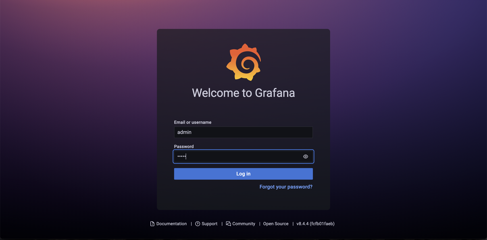
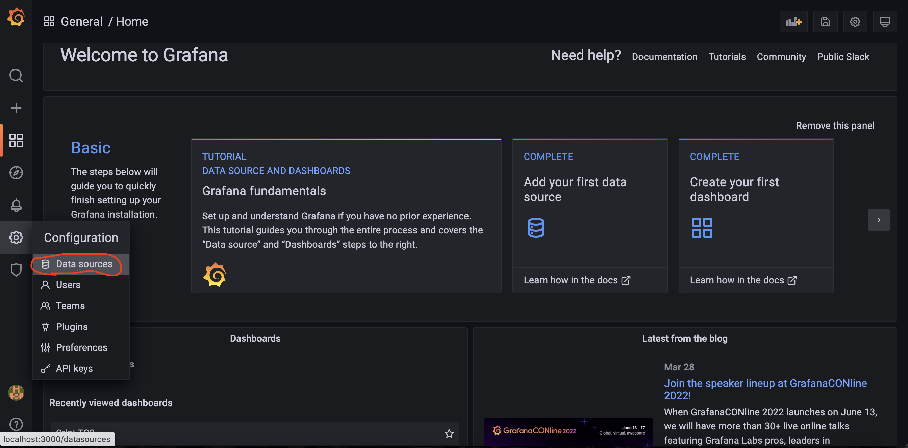
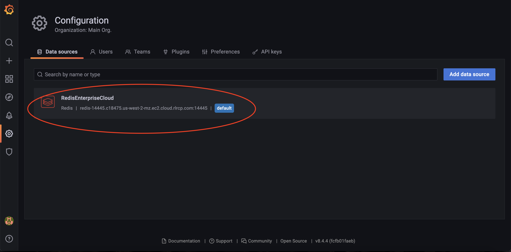
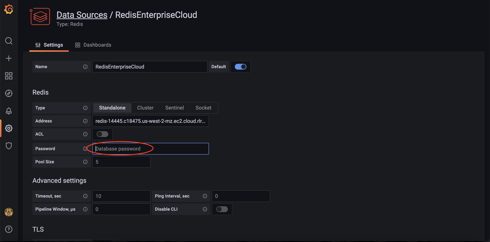
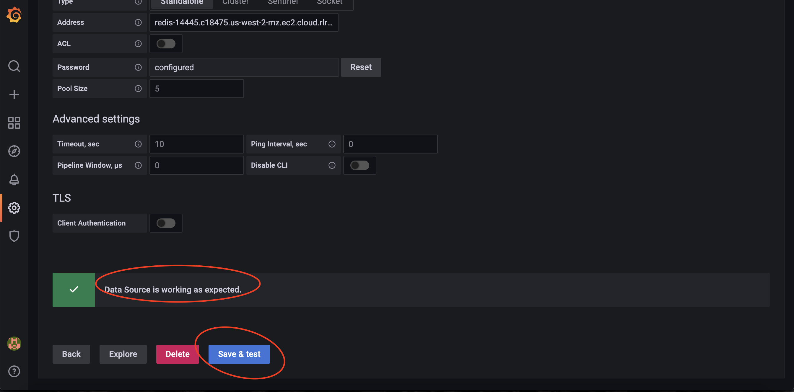
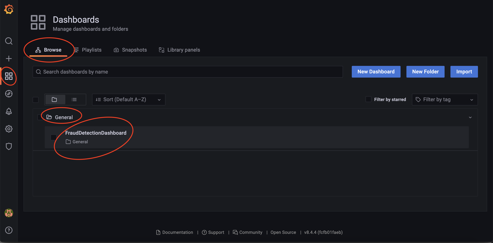
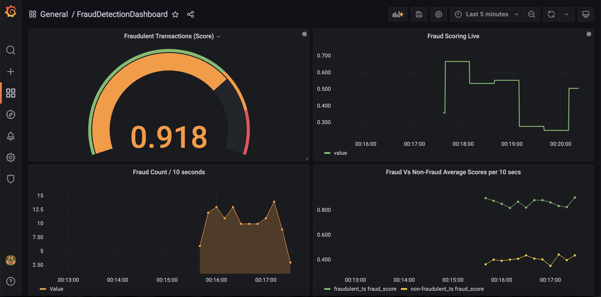

# Realtime Fraud Detection powered by Redis Enterprise Cloud on AWS

This repo contains utility code for the [Redis Enterprise Fraud Detection Solution Brief.](https://redis.com/docs/enhance-fraud-detection-systemswith-redis-and-aws/) <br>
They are for demonstration purposes and not meant for production.  

## Solution Architecture
The solution architecture can be found [here](https://d1.awsstatic.com/architecture-diagrams/ArchitectureDiagrams/aws_redis_realtime_fraud_detection_ra.pdf?did=wp_card&trk=wp_card).

## Product Demo

https://user-images.githubusercontent.com/6223831/181816977-30684a43-7f0e-47df-9b85-faca8c19387b.mp4

You can also find this demo video in `docs\media` folder.

## Pre-requisites
Prior to running this application, please ensure following pre-requisites are installed and configured.

- [Docker](https://www.docker.com/products/docker-desktop)
- [Docker Compose](https://docs.docker.com/compose/install/)
- [Terraform](https://www.terraform.io/downloads.html)
- [AWS CLI](https://docs.aws.amazon.com/cli/latest/userguide/getting-started-install.html)
- [Redis Enterprise Cloud](https://redis.com/redis-enterprise-cloud/overview/)

## Setup:
### Redis Enterprise Cloud
Install and setup Redis Enterprise Cloud in AWS. Redis Enterprise Cloud is a fully managed solution and very easy to setup. Go to https://app.redislabs.com/#/login, subscribe, get an account and start configuring your subscription and databases.

### Amazon SageMaker
#### CloudFormation Setup
You will find a CloudFormation template in this  folder, at this path : `aws\sagemaker\fraud-detection-using-machine-learning.template`.  We will use this to create a Cloud Formation stack in AWS.
1. Create a stack. Give it a name.
2. Simply upload the template file : `aws\sagemaker\fraud-detection-using-machine-learning.template`
3. The stack will ask you to configure S3 bucket names for your Model Data and for Results.


4. Proceed creating the stack. 

Once the CloudFormation stack completes its run, following cloud resources will be created :
- Amazon SageMaker Instance Notebooks
- Amazon SageMaker Instance Lifecycle Configurations
- Appropriate IAM roles, policies
- S3 buckets needed for input data and for saving output (results)

#### Run Amazon SageMaker Notebook
Run the Jupyter SageMaker notebook found in the Amazon SageMaker Instance. 
Run it  cell by cell and this demo does not require you to run the entire Notebook as is.
For more details, please see the product  demo video.

After you run the Amazon SageMaker Notebook, you will create the following cloud resources.
- Model training jobs for `Random Cut Forest` & `XGBoost` algorithms
- Deployed Model endpoint configurations and Model endpoints
- S3 buckets that has the input and output buckets with trained data and results

### AWS Lambda
You will deploy an AWS Lambda function as a container, using the instructions given [here](https://docs.aws.amazon.com/lambda/latest/dg/images-create.html).
The Lamdba function code is found in this folder: `aws\lamdba`
Edit the `lambda_configs.properties` to reflect appropriate Redis Enterprise Cloud database endpoints. 

Example:
```
REDIS_HOST=redis-15381.c20502.us-east-1-mz.ec2.cloud.rlrcp.com
REDIS_PORT=15381
REDIS_PWD=t4Ye29t1ZpPCfoVh340s3uRGHEd8Gvmhc
```

1. Create the docker image from AWS base image by following the instructions given [here](https://docs.aws.amazon.com/lambda/latest/dg/images-create.html#images-create-from-base).
2. Use the `Dockerfile` provided in the folder `aws\lambda`
3. Upload the docker image to Amazon ECR Repository by following the instructions given [here](https://docs.aws.amazon.com/lambda/latest/dg/images-create.html#images-upload).
4. Create the lambda function using the `Container image` option, give it a name and point it to the container image you have created in the above step


Make sure that the above lambda function has a IAM Role with `AmazonElasticContainerRegistryPublicFullAccess` previleges

### Amazon Kinesis
We will setup Amazon Kinesis Datastream to capture end-user credit card transactions. 
Give it a name called `demo-stream`.  Setup the batch size as 1 instead of 100, just to simulate kinesis reading one transaction at a time.


Now goahead and setup this Kinesis datastream `demo-stream` as a trigger to the lambda function created above.


## Run the demo

Go ahead and enable a Python virtual environment.

```
python3 -m venv aws-fraud-detection-demo.venv
source aws-fraud-detection-demo.venv/bin/activate
pip install -r requirements.txt
```

Next get the input data needed for simulating end-user transactions.
```
cd data
wget https://s3-us-west-2.amazonaws.com/sagemaker-e2e-solutions/fraud-detection/creditcardfraud.zip
unzip creditcardfraud.zip
```

Next, run the Producer.
```
python3 ./utilities/producer2.py
```
This will start producing events into an AWS kinesis stream. This is to simulate the end user events and capturing those transactions realtime for Fraud detection.

The events will immediately trigger the Lambda function and you can observe the lamdba acting on those events by 
- persisting the transactions as they are in to **Redis Enterprise Cloud** database
- making inferences to the Amazon SageMaker
- persisting back those results in to **Redis Enterprise Cloud** Timeseries database


## Data Visualization
Data visualization is done using Grafana dashboards for **Redis Enterprise Cloud**
These docker containers, for simplicity, run on your local machine.
You will use the `docker-compose.yml` for spinning up Grafana docker container locally.
Run it:
```
docker-compose up
```

Next, edit the `terraform\grafana.tf` to reflect Redis Enterprise Cloud endpoint ( Hostname: Port). Search for `grafana_data_source` section and update the Redis endpoint.


Using terraform, install Redis data source plugin in the Grafana docker container and also setup Grafana dashboards.

```
cd terraform
terraform init
terraform apply
```

Once the containers are up and running, fire up a browser and point it to :

[Dashboard Link](http://localhost:3000)

Login as admin/admin. Feel free to skip changing the default Grafana password.


Next, go to the settings and make sure the Data source `RedisEnterpriseCloud` is correctly configured with appropriate password and hit "Save and Test" button.








Now go to Dahsboards and load up the only dashboard that is already configured using terraform. The dashboard should be displaying the TimeSeries visualizations.





## Cleanup:
Clean up the Grafana Dashboard containers by running these commands.
```
terraform destroy
docker-compose down
```


# Code snippets for generic reference
This repo includes miscellaenous code snippets in the form of these files, for your reference, to serve as a starting pointers.  By no means, we recommend that this code is production deployment ready. Please exercise your organizations software engineering and development practices, to adopt any part of the code found here in this repository.

## `./utilities/producer.py`
Producer.py reads the transactions from the `./data/fraud_test_data.csv` and sends them over to a Kinesis stream as JSON document. You can pass an argument to the script like, by default it's 100:
 ```
python3 ./utilities/producer.py 1000
```
This argument tells the script to process number of lines from the last processed line. The last processed line is stored on the `./data/last_line.txt`

You can create a Kinesis stream via AWS CLI like:
```
aws kinesis create-stream --stream-name demo-stream --shard-count 1
```

## `./utilities/consumer_json.py`
Consumer_json.py reads the transaction from the Kinesis stream and sinks it to the RedisJSON database. RedisJSON is the primary database of the solution.

## `./utilities/consumer_ts.py`
Consumer_ts.py reads the transaction from the Kinesis stream and sinks it to the RedisTimeSeries database. This TS database is mainly to be used for real-time dashboards/reports.

## `./utilities/query_ts.py`
Query_ts.py shown an example on how to consume data from RedisTimeSeries database. Please refer to the [documentation](https://redis-py.readthedocs.io/en/stable/redismodules.html#redistimeseries-commands) for all the commands and their parameters.
```python
get_mrange(
    from_time = "-", # minimum possible timestamp
    to_time = "+", # maximum possible timestamp
    aggregation_type = "count", # optional aggregation type.
    bucket_size_msec = 1000, # time bucket for aggregation in milliseconds
    filters = ["category=home"] # filter to match the time-series labels.
)
```
